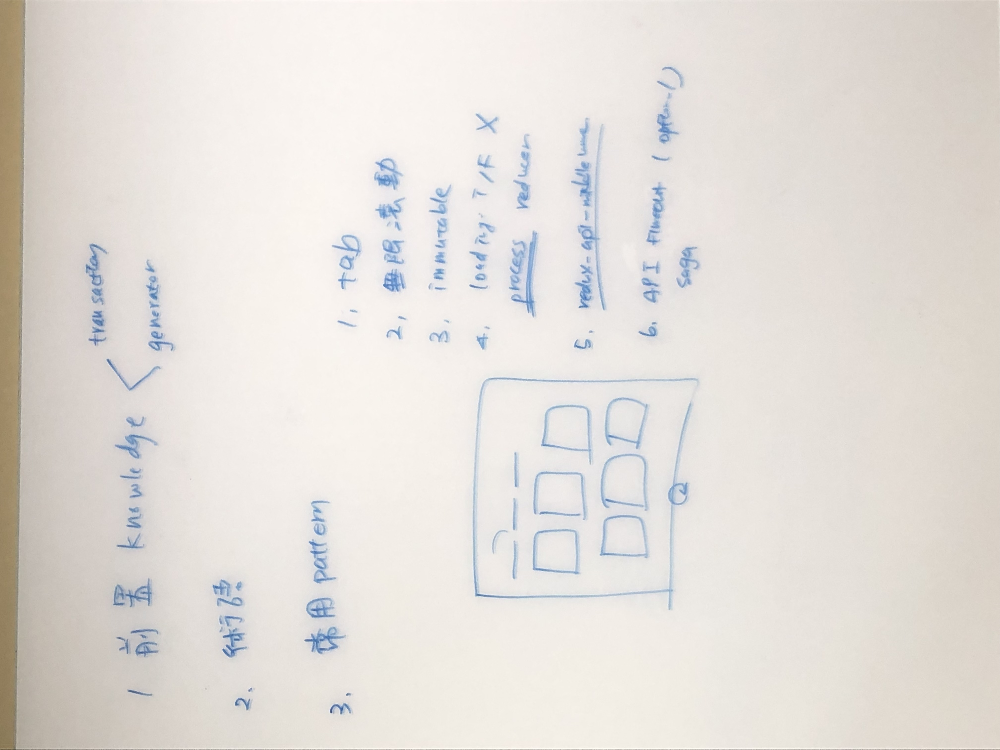
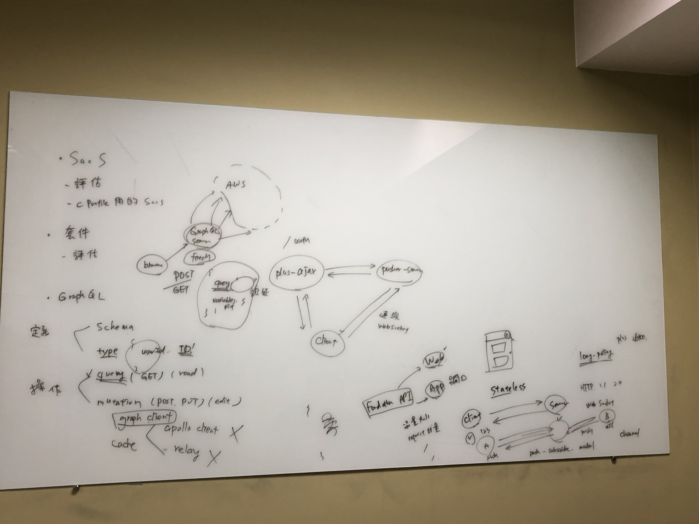

# 開發知識分享紀錄

## 2019-01-29 第一堂

-16df1dbd-0037-4d06-8e40-c2f6a7225e31.jpg)

- 串 API 的概念
  - 確定 UI 操作流程、畫面顯示的欄位
  - 可能的實作方法
  - 與後端討論 API 介面
- RSAA
  - 一般用法
  - 專案客製功能用法
    - before
    - next
    - error
    - processMethod
  - 運作原理
    - middleware 檢查格式
    - epic 實際操作
    - fetch 取消
    - 降低頻繁觸發：debounce、throttle
- loading、error 狀態管理
  - flag (boolean / string)
  - process
- Redux 進階概念
  - selector
  - normalize
- Immutable
  - List (順序)
  - Map (不重複)
  - Record (預設值)

---

## 2019-02-01 第二堂

- 前置知識
  - [Transaction 交易](http://karenten10-blog.logdown.com/posts/192629-database-transaction-1-acid)
    

    - 銀貨兩訖 (commit & rollback)
    - ACID 特性
      - Atomicity 原子性：全有全無
      - Consistency：一致性，交易前後資料一致
      - Isolation：隔離性，處理中不能被其他 transaction 影響
      - Durability：持續性，如果系統 error，恢復後仍要繼續未完成的工作
    - 長時間的交易 Long Lived Transaction (LLT)
      - 高機率 failure、風險很高
      - 應對方法
        - 分割成許多小交易 ⇒ sub transaction
        - 可以復原 compensating transaction (undo)
    - [JavaScript ES6 Generator & Iterator](https://denny.qollie.com/2016/05/08/es6-generator-func/)
      - function：run-to-completion (一鏡到底)
      - generator：延遲運算(Lazy evaluation or call-by-need)，可以被暫停，被呼叫才執行下一步
      - 控制權轉移 delegate yield*
- redux-saga
  - [Saga Pattern 原始論文](http://www.cs.cornell.edu/andru/cs711/2002fa/reading/sagas.pdf)
  - [必讀新手教學](https://denny.qollie.com/2016/05/14/redux-saga/)
  - [必讀官方教學](https://neighborhood999.github.io/redux-saga/)
  - [術語](https://neighborhood999.github.io/redux-saga/docs/Glossary.html)
    - effect：物件，給 middleware 執行一些操作的說明指令
    - task
    - helpers：傳入 generator，產生 task
    - watcher
    - worker
    - [block & non-block](https://neighborhood999.github.io/redux-saga/docs/api/)
  - 常用 Pattern
    - take and fork (non-block)
    - take and call (block)
    - put and take
      - 常用於 API
    - array of effects
      - all：平行執行，全部完成才走下一個
      - race：同時發出，只取第一名
      - 只取最後一名：自己實作
    - call：function、apply
    - 邏輯設計：common saga、flow saga、API timeout、try catch

---

## 2019-02-12 第三堂

- SaaS 介紹
  - 評估
    - [和寫 css 的 sass 不同](https://www.wikiwand.com/zh-tw/%E8%BD%AF%E4%BB%B6%E5%8D%B3%E6%9C%8D%E5%8A%A1)
    - 低費用優先，有 free plan 試用最好
    - 列舉並比較可能做法，盡可能用 Open Source 解法降低開銷
    - 盡量使用公司其他團隊已用過的服務
    - 全新的服務，需要走資安評估流程 (看文件填表單)
  - C Profile 使用的 SaaS
    - [Pusher](https://pusher.com/docs)
      - Request Response Model is stateless
      - Long-polling (Plus ppush 通知作法)
      - WebSocket
      - 與 Pusher Server 建立連線的流程 (plus-ajax server 作法)
      - Server 連線 ⇒ 訂閱 Channel (Pub-Sub Model)
      - Pusher Epic 處理各種事件
      - 如何測試 WebSocket 串通：debug console + chrome dev tool ws frames
    - LogRocket
      - 如何用 LogRocket Debug
      - 裁切 Crop Session
      - 判斷該 session 是哪個版本：Release (Commit SHA)
      - 判斷每個環境的 session 使用量
      - Filter 應用
      - 簡介原理 (複寫、監聽原生 console、fetch、xmlHttpRequest)
      - middleware 設定 (資料遮蔽)
      - slack 通知設定
    - Wootric (目前拿掉)
      - NPS 問卷調查
      - 觸發規則寫在 containers/survey.js
    - Drift
      - 線上客服系統
      - 如何在收到反應時，找出對應的 LogRocket Session （Activity Timeline)
- 套件評估
  - [查找套件漏洞的來源 CVE](https://cve.mitre.org/index.html)
  - [Github Security Alert](https://github.blog/2017-11-16-introducing-security-alerts-on-github/)
  - [Snyk 服務](https://snyk.io/)
- GraphQL
  - 為何要使用 GraphQL
    - API 同時服務 App 與 Web
    - 裝置效能、流量費用考量：封包資料大小盡可能小、request 數量盡可能少
    - 類似實作：Plus 販賣機
  - [概念](https://graphql.org/learn/)
    - 定義資料結構
      - Schema
      - Type
    - 操作
      - Query
      - Mutation
  - 如何串接 GraphQL Server
    - GraphQL Client Library (多了 Cache 管理)
      - Apollo Client
      - Relay
    - Direct GET/POST with fetch
  - [Apollo Client](https://www.apollographql.com/docs/react/api/apollo-client.html)
    - client options (link：類似 middleware、cache)
    - query 寫法
      - gql query string
      - fragment
  - 參考資料
    - [https://ithelp.ithome.com.tw/articles/10200678](https://ithelp.ithome.com.tw/articles/10200678)

---

## 2019-02-14 第四堂

-0d6cce42-22c7-4a5e-95a5-20a1157848c5.jpg)

- React Component Pattern
  - 了解 React 如何產生一個 component
    - [React Without JSX](https://reactjs.org/docs/react-without-jsx.html)
    - [觀察 Babel 將 JSX 轉成可執行的 js code](https://babeljs.io/repl/#?babili=false&browsers=&build=&builtIns=false&spec=false&loose=false&code_lz=Q&debug=false&forceAllTransforms=false&shippedProposals=false&circleciRepo=&evaluate=false&fileSize=false&timeTravel=false&sourceType=module&lineWrap=true&presets=react%2Cstage-0&prettier=false&targets=&version=7.2.2)
    - children 定義、render function 定義
  - 參考資料
    - [進階 React Component Patterns 筆記（上）](https://blog.techbridge.cc/2018/06/27/advanced-react-component-patterns-note/) 必讀！！！
    - [進階 React Component Patterns 筆記（下）](https://blog.techbridge.cc/2018/07/21/advanced-react-component-patterns-note-II/) 必讀！！！
    - [2018 Modern Web React Pattern 簡報](https://www.slideshare.net/JOEYCHUNG2/use-react-patterns-to-build-large-scalable-app)
    - [React Patterns](https://reactpatterns.com/)
  - render props
    - 自定義的 render function 作為 prop，例如：renderMenu、renderMenuItem
      - 最終只會有一個 component，例如 react-component 的用法
    - this.props.children
      - 優點是傳給子元件的 API 可以明顯地被展示
      - 優點也是缺點，都帶 function 撰寫上有點煩
    - 適用於需要將元件放在 render function 中的情境
  - high-order component (hoc)
    - 傳入 component，回傳新的加強版 component，例如：systemMessage
    - 傳入 component、設定檔，回傳新的加強版 component，例如：connect、blockingAlert
    - 注意細節
      - hoc component 本身要記得命名
      - 若設計成可以傳入設定值 (如：connect)，要注意順序 (currying)
    - 適用於不需要將元件放在 render function 中的情境
- Redux Middleware
  - 位置在 reducer 之前
  - applyMiddleware 傳入 middleware 的順序，由左至右代表 middleware 執行順序
  - 固定的 currying 寫法：({ getState, dispatch }) ⇒ next ⇒ action ⇒ {}
  - 可以在這邊做任何想做的事，包含改變 action、多發送 action、攔截 action、side effect ...
  - 注意事項
    - middleware 是 global 的，沒寫好會讓 redux 全壞掉
    - next 代表 dispatch action，一定要確保 next 的值符合 { type: ... } 否則會報錯
    - return 對 middleware 不代表特別意義，僅用來提早結束而已
- Clean Code
  - 推薦文章
    - [5 Tips to Write Better Conditionals in JavaScript](https://scotch.io/bar-talk/5-tips-to-write-better-conditionals-in-javascript#toc-1-use-array-includes-for-multiple-criteria)
    - [clean-code-js](https://github.com/alivebao/clean-code-js)

## 2019-02-19 第五堂

-a31e8e9a-7692-4244-9277-7ecec06dce78.jpg)

- GraphQL
  - 基本概念
    - 為何使用 GraphQL：轉移組裝資料的主控權
  - 使用 GraphQL Service
    - 如何發請求取用資料
      - fetch / XMLHttprequest
        - 安裝 GraphQL Client 套件
    - 讀取 Query
      - 如何寫 Query 重要
      - 傳入參數時使用
    - 修改 Mutation
    - Fragments ⇒ 切片，自由組裝 Model
    - Aliases
      - 無法針對相同 field 帶不同參數，必須將結果重新命名
      - 某些欄位改名字
    - Operation
      - Operation Type (query, mutation, subscription)
      - Operation Name：function name，可自定義
    - Variables ⇒ 傳入動態參數 ⇒ 從 operation 層 (query) 傳下去
    - [GraphQL Client 可用工具](https://graphql.org/code/#graphql-clients)
  - 提供 GraphQL Service
    - 定義可用資料：type、schema
      - 純量型別 Scalar Type
        - Int、Float、String、Boolean、ID
        - Custom Scalar Type
      - 枚舉型別 Enumeration Type
      - Lists
      - Interfaces
      - Non-Null (!)
        - [String!] ⇒ 不一定是陣列，是陣列的話內容一定要是字串
        - [String]! ⇒ 一定是陣列，長度可以為 0
      - Union ⇒ conditional fragment
      - Input ⇒ 傳入整個 object
    - 實際處理資料：resolver
      - schema first ⇒ 先定義 schema 再實作
      - code first ⇒ 先完成功能，爬取 schema 定義
    - 互動式文件 (with graphql endpoint)
      - [GraphiQL](https://github.com/graphql/graphiql)
      - [GraphQL Playground](https://github.com/prisma/graphql-playground)
    - [GraphQL Server 可用工具](https://graphql.org/code/#server-libraries)
  - Apollo Client
    - [Apollo Links](https://www.apollographql.com/docs/link/overview.html)：類似 middleware
        
    - Apollo Client 寫法
      - link
      - cache
  - Online Editor
    - [GraphQL Editor](https://app.graphqleditor.com/) (功能尚未齊全，但可以關注，未來應該滿好用的)
    - [Apollo Launchpad](https://launchpad.graphql.com/new) ⇒ 已棄用
    - [CodeSandbox with Apollo Server](https://codesandbox.io/s/apollo-server)
    - [Glitch with Apollo Launchpad](https://glitch.com/~apollo-launchpad)
- 補充資料
  - [AWS AppSync serverless GraphQL service for PWA](https://www.slideshare.net/AmazonWebServices/graphql-aws-appsync-progressive-web-app-pwa-level-200)

## 2019-02-21 第六堂

- 測試概念介紹
  - 常見名詞
    - Test Runner
      - 實際執行測試的環境，並輸出結果
      - Mocha、Jasmine (Jest)、AVA
    - Assertion Library
      - 斷言庫，驗證測試結果
      - Should、Chai、Expect
    - Test Double
      - 為了隔絕測試目標的相依性，用來模擬相依性的手法
      - [深入探討 Test Double、Dummy、Fake、Stub 、Mock 與 Spy](https://oomusou.io/jasmine/jasmine-test-double/)
        - Mock：不在乎 function 回傳值，只在乎 function 是否被呼叫過
        - Stub：建立包含假資料的假物件，並用假資料來測試結果
        - Fake：重新實作 function 取代原本的 function
        - Dummy：單純為了滿足參數所建的假物件，但測試中根本不會用來驗證結果
        - Spy：當 Stub 與 Mock 不夠用，自己必須埋入測試用的邏輯
      - Jest、[Sinon](https://sinonjs.org/)、[testdouble.js](https://github.com/testdouble/testdouble.js)、redux-mock-store ...
    - Snapshot
      - 快照
  - 測試種類
    - 單元測試 Unit Testing
    - 整合測試 Integration Testing
    - 端對端測試 End-to-end Testing
  - 寫好測試的原則
    - 測試金字塔

    

    - 3A 原則 (given-when-then)
      - Arrange：初始化
      - Act：呼叫目標方法
      - Assert：驗證結果
    - 記錄規格，表達力極強
    - 僅有一個會失敗的理由
    - 快、穩定，測試程式中不要包含邏輯
  - [BDD](https://hackmd.io/p/BydLW7Xi7#/)
- 前端單元測試
  - CRA + Jest 設定
  - [單元測試策略](https://github.com/linesh-simplicity/linesh-simplicity.github.io/issues/200)
  - Jest 測試寫法
    - 只改參數：test.each
    - 只測某個案例： it.only
    - mock 模組

- 參考資料
  - [30天快速上手 TDD](https://ithelp.ithome.com.tw/users/20010292/ironman/462)
  - [React 前端單元測試教學](https://medium.com/@savemuse/react-%E5%89%8D%E7%AB%AF%E6%B8%AC%E8%A9%A6%E6%95%99%E5%AD%B8-2ccedbe79411)
  - [用jest+enzyme來寫Reactjs的單元測試吧](https://github.com/Hsueh-Jen/blog/issues/1)
  - [單元測試：Mocha、Chai 和 Sinon](https://cythilya.github.io/2017/09/17/unit-test-with-mocha-chai-and-sinon/)
  - [一次搞懂單元測試、整合測試、端對端測試之間的差異](https://blog.miniasp.com/post/2019/02/18/Unit-testing-Integration-testing-e2e-testing)
  - [使用 JEST 進行前端單元測試](https://blog.patw.me/archives/1310/write-frontend-unit-tests-with-jest/)

---

## 2019-02-22 第七堂

- 開發環境設定 (CRA)
  - CRA eject 做過的客製化部分
    - Prerender
    - Git Hook for test and image compression
    - Mock Server
  - [proxy](https://facebook.github.io/create-react-app/docs/proxying-api-requests-in-development)
  - [https](https://facebook.github.io/create-react-app/docs/using-https-in-development)
  - [env](https://facebook.github.io/create-react-app/docs/advanced-configuration)
- DevOps 簡介
  

  > 「開發」「測試」「維運」三位一體
  > [請先讀 miles 大大的 30 天文章再開始](https://ithelp.ithome.com.tw/users/20102562/ironman/987?page=1)

  - [為什麼需要 DevOps](https://www.ithome.com.tw/news/96861)
    - 開發團隊、維運團隊的思維迥異，造成協作的衝突
    - 正值 Agile、ESM 運動發酵時期，部分導入產生的不協調
  - DevOps 可以帶來什麼效益
    - 提高透明度，並整合開發、維運兩者
    - 快速交付高品質的產出
  - 所以 DevOps 具體是什麼
    - CALMS
      - *Culture：開發多去想維運面，維運多去想開發面*
      - *Automation：自動化取代手動 SOP*
      - *Lean：精實軟體開發，學習不同職能*
      - *Measurement：數據 ⇒ 決策、改進方向*
      - *Sharing：分享，包含知識、經驗、數據等*
- DevOps 實踐
  

  - 必備條件
    - 採用敏捷開發 (agile)，團隊 2/3 以上都是開發者
    - MicroService 導向
    - 團隊內部透明化，減低成員之間的知識斷層，任何成員都能接手他人的事情
    - 自動化工作項目
  - 最重要的第一步：好的開發習慣
    - ~~先求有再求好~~ ⇒ [先要對，才會有，再求好](https://ithelp.ithome.com.tw/articles/10184833)
      - 頻繁驗證 ⇒ 自動化測試
      - 記錄開發歷程 ⇒ 原始碼版本控制系統
      - **正確** 才能提交，有錯 **立即修**
      - 常常提交與更新程式碼 ⇒ 小步提交
  - [自動化 pipeline](https://ithelp.ithome.com.tw/articles/10186989)
    - 開發階段
      - 靜態測試：不影響程式結果的檢查，包含 linter、coding style ...
      - 動態測試：測試程式執行結果
    - [提交階段](https://medium.com/asiayo-engineering/%E8%87%AA%E5%8B%95%E5%8C%96-pull-request-%E7%9A%84%E9%82%A3%E4%BA%9B%E6%97%A5%E5%AD%90-8f6cbb88a77)
      - git hook for commit message, coding style, unit test
        - [husky](https://github.com/typicode/husky)
        - [lint-staged](https://github.com/okonet/lint-staged)
        - [glob validater](http://www.globtester.com/)
        - [node-glob](https://github.com/isaacs/node-glob)
        - [Pro Git](https://git-scm.com/book/zh-tw/v2)
      - CI (Continuous Integration)：持續整合
        - 監控 Repo 狀態，自動進行 build、test
        - [可用工具](https://ithelp.ithome.com.tw/articles/10187137)：Dapper、Travis CI、Circle CI、Pipelines、Jenkins
      - CD (Continuous Deployment)：持續部署
        - CI 檢測過後觸發 CD，自動部署程式碼到機器上
        - 可用工具：
      - CM (Configuration Management) ：配置管理
        - 組態管理
          - Config File
          - Package (套件)
          - Role / User / Group
          - Crontab
          - Environment 環境變數
          - Shell Script
        - 可用工具：Ansible、Chef、Puppet、SaltStack
        - [Puppet ⇒ 組態管理 x Infrastructure as Code x 自動化 (CI/CD)](https://s.itho.me/devopsdays/2018/0911-1120-b.pdf)
- 演練
  - Git Hook
    - prettier
    - jest unit test
  - Travis CI
    - building, testing, deploying
    - 撰寫 travis.yml
    - 設定環境變數存 key
  - Slack
    - 新建 workspace
    - webhook 串接
- 參考資料
  - [什麼是 DevOps？](https://aws.amazon.com/tw/devops/what-is-devops/)
  - [未來趨勢：DevSecOps](https://www.slideshare.net/AmazonWebServices/devsecops-level-300400)
    
  - [未來趨勢：Full Cycle Developer !?](https://medium.com/netflix-techblog/full-cycle-developers-at-netflix-a08c31f83249?fbclid=IwAR0aqfu6xINNQu9AlueI9mfFXvhE_lsS-9q78j25ELljEF3UL6mAPwHqyKs)

    
  - [研討會：DevOpsDay Taipei](https://devopsdays.tw/books.html)

## 2019-02-26 第八堂

- C Profile 維運
  - 文件
    - [專案介紹](https://github.com/104corp/104fp-f2e-cprofile/blob/dev/introduction.md)
    - [開發 README](https://github.com/104corp/104fp-f2e-cprofile/blob/master/README.md)
    - 含機敏資訊維運文件
  - 解答疑問為主，細節在各場 C Profile 講解會議講過了
- Plus 維運
  - 文件
    - [Lobby](https://github.com/104corp/104plus-f2e-Lobby)
    - 含機敏資訊維運文件
  - 問題檢測 SOP
    - Node.js Server 架構與伺服器資訊
    - Sigt 檢測機器健康度
    - 直接打 Restful API (postman、curl、swagger)
    - 直接打 WSO2 API
  - proxy 連線申請
- Message UI 維運
  - [文件](https://github.com/104corp/104fp-message-center/tree/lab)
  - 程式架構講解